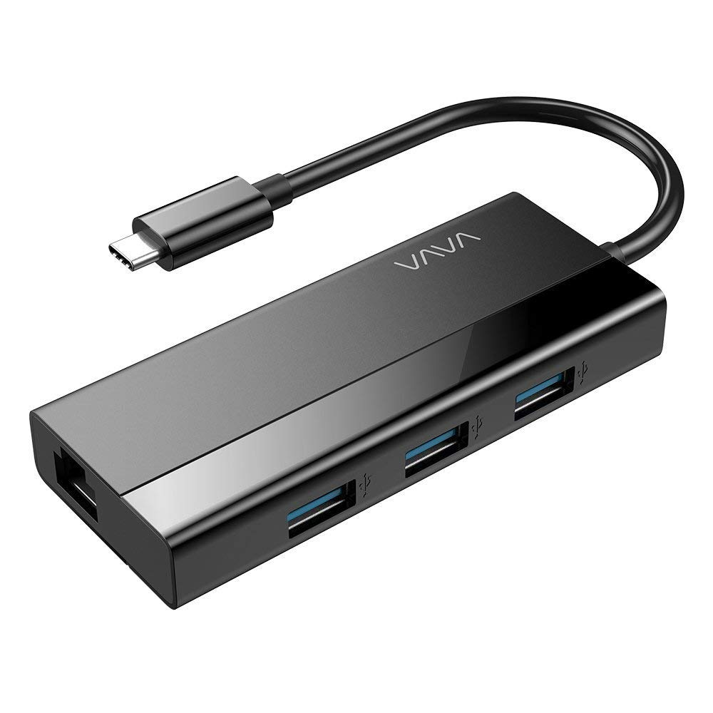

# FirstSite

## Github Pages
This is an experiment with setting up github based website.  You can bring up this web site using this link:

[FirstSite](https://davidhsmith.github.io/FirstSite)

Try it now by clicking on the link above!

Github Pages is really easy to set up and use, and it is free.  This handles static web sites only and the web pages are all inside of a git repository.  Of course, the repository can be edited on any PC and simply committed to github.  The root web page is created from README.md.  I created this file directly on [GigHub](https://GitHub.com) using their direct-edit tool for text files.  This works out to be usable, but a little awkward, so I will be investigating more powerful markdown editors.  Being able to create static web pages on a PC, then push them to [GitHub]() certainly seems to be a possiblity for a journaling tool.  GitHub's recommendation seems to be a tool named [jekyll](https://jekyllrb.com)

## Image handling: USB C Hub for ASUS VivoBook
Here's a picture of the USB Hub with gigabit Ethernet that I bought off Amazon to use with my ASUS VivoBook.  The VivoBook doesn't have an Ethernet Port and limited USB.

Surprisingly that worked great on the image.  It is inserted and resized to fit between inside the Web page paragraph width.

As an aside, the adapter seems to work awsome - I got full 1-Gigabyte transfer speeds using iperf3.

